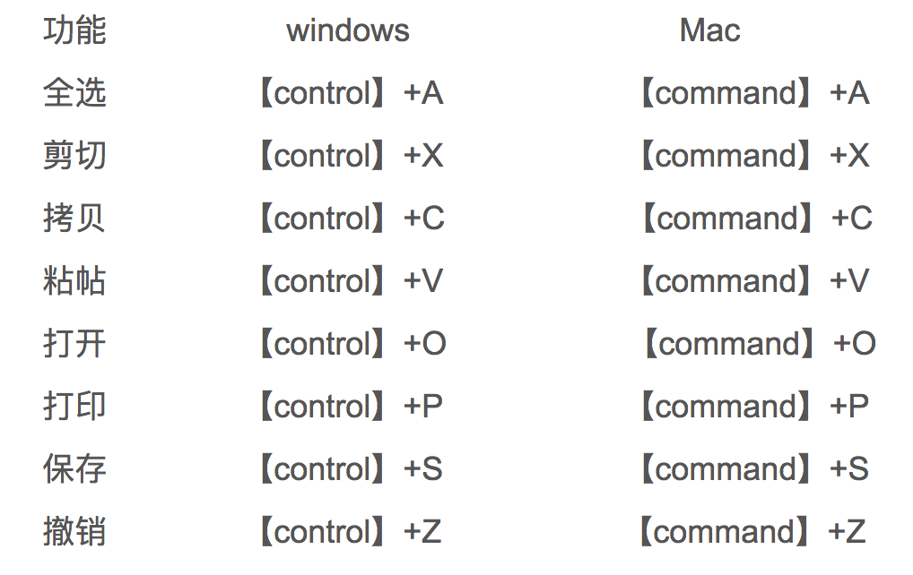

# Macbook键盘的使用基础技巧[转]

原文地址：http://blog.csdn.net/u012200908/article/details/39138033

## Mac OS按键符号对照

```
⌘——Command () 
⌃Control 键图标——Control
⌥Option 或 Alt 键图标——Option (alt) 
⇧——Shift   
⇪——Caps Lock 
fn——功能键就是fn
```

## 一、“三驾马车”的使用
【command】【option】【control】是键盘上相对最重要的3个按键，也就是“三驾马车”，许多的功能都需要他们来实现。

(1)【command】是Mac独有的按键，其实际功能很多地方那个相当于windows下的control键



（2）【option】键

【option】键上方标注了alt，其功能如windows下alt有相同又有不同，主要配合其他键位组成快捷键以方便操作。

另一个功能就是在用户使用bootcamp来装了双系统之后，会设置一个默认启动的系统，当你想进入另一个系统或者进入recovery，就需要开机白屏的时候立马按住option来选择启动磁盘。有关Bootcamp安装双系统会在后面详细说明。

（3）【control】键

这个键位Mac系统下不是太常用，这里要说一下，按下【control】+鼠标左键相当于按鼠标的右击。

**最后说一下开机键下方的【delete】**

这个键位的作用相当于windows下的【Backspace】键。

如果需要删除当前文本最下方的字符，按住【fn】+【delete】就可以缩减行数。如果要删除文件，选中后要按下【command】+【delete】即可。