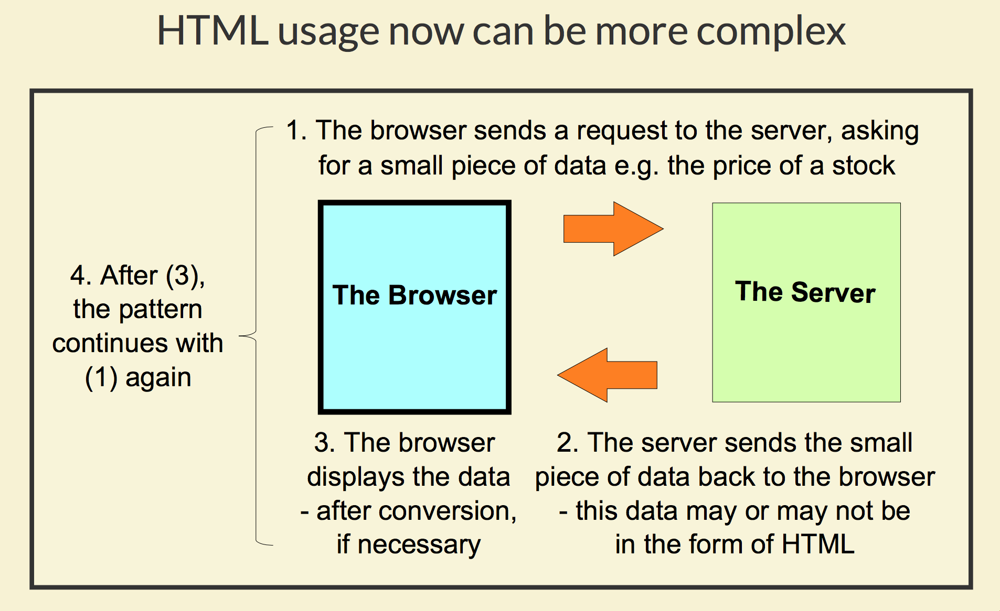
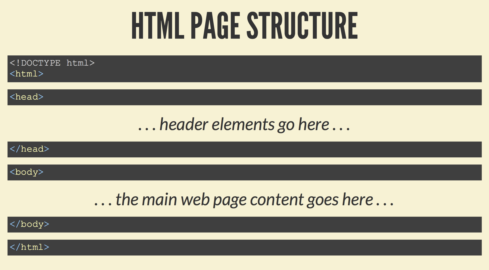

# The basics of HTML

This blog is the notes of a coursera course named Full Stack Web Development. Actually, I have learned much web development knowledge in the master degree of Monash University, and I have developed a web application called Safe Beach in the last semester. However, full stack development is the new concept for me and I want to have a more detailed and organised web development knowledge from this course. The capstone project at last is a good experience for me to improve my resume and I hope I can get a dream job in Melbourne in the future.


## HTML

HTML is the main language for building a web page 

Around since the 1990's

Latest version is HTML 5, which we use



## HTML vs SVG

**SVG** - graphics approach, few libraries 

**HTML** - text approach, many libraries

## HTML ELEMENTS WE WILL LOOK AT
```
Structure <html> <head> <body>
In<head>  <meta><author>
          <style> <link> <script> <base>
In<body>  <h1><p>
```


## Meta information
```
<meta name="description" content="An example">
<meta name="keywords" content="HTML, CSS, JavaScript">
<meta charset="UTF­8">
```

Words: start tag, end tag, HTML commands are called elements, \<h1> means level 1 heading

## View the HTML of any page

Keyboard: opt + command + U

End